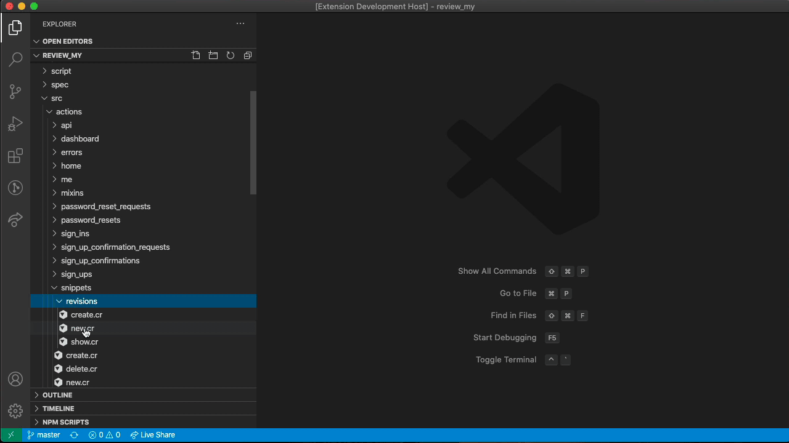

# VSCode Lucky

Supercharge your Lucky development in VSCode!

## Features

| Command                  | Description                                                           |
| ------------------------ | --------------------------------------------------------------------- |
| `Lucky - Open Model`     | Open the relevant Lucky model from a page, action, or operation file. |
| `Lucky - Open Operation` | Open the relevant Lucky operation from a page, action, or model file. |
| `Lucky - Open Action`    | Open the relevant Lucky action from a page file.                      |
| `Lucky - Open Page`      | Open the relevant Lucky page from an action file.                     |

 
 

