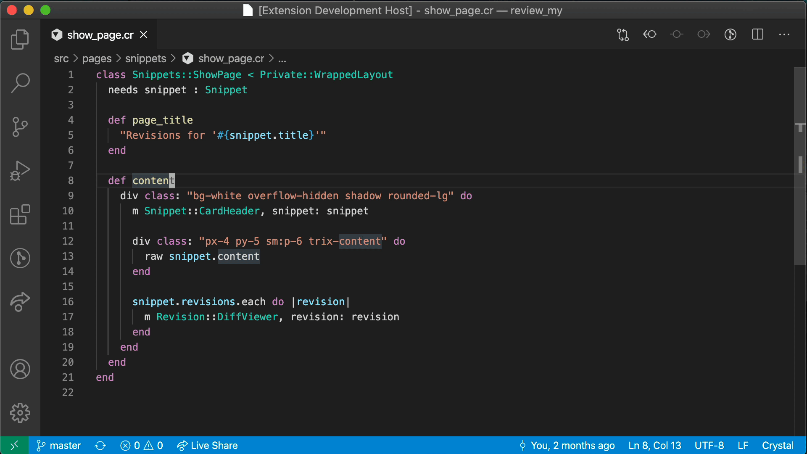
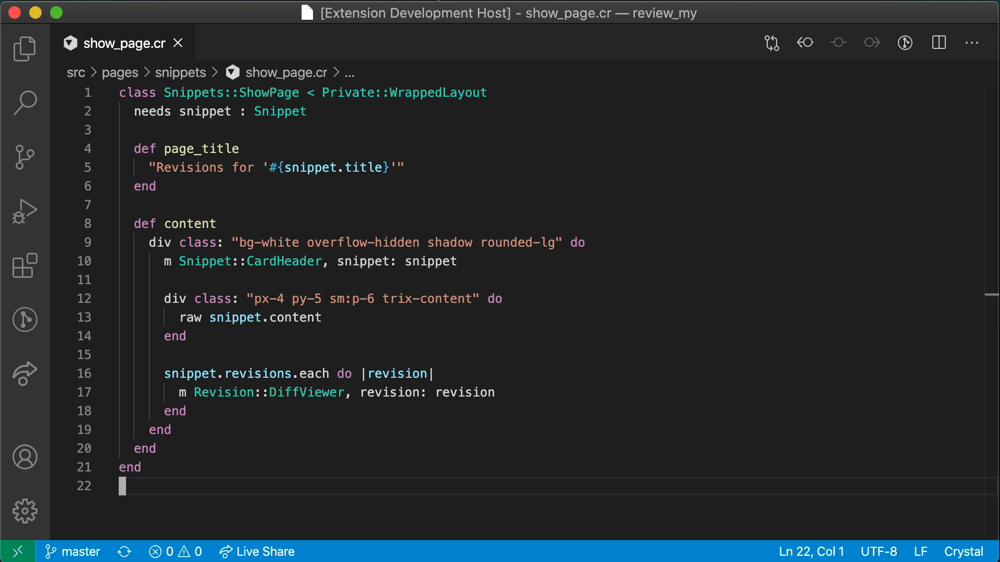

# VSCode Lucky

Supercharge your [Lucky](https://luckyframework.org) development in VSCode!

## HTML Conversion Commands

| Command                | Description                                                                                    |
| ---------------------- | ---------------------------------------------------------------------------------------------- |
| `Lucky - Convert HTML` | Replaces selected HTML text using the [Lucky HTML Converter](https://luckyframework.org/html). |

 

## Lucky Page Extraction Commands

| Command                  | Description                                                 |
| ------------------------ | ----------------------------------------------------------- |
| `Lucky - Extract Method` | Pull the selected page content into a private class method. |

 

## Navigation Commands

| Command                  | Description                                                           |
| ------------------------ | --------------------------------------------------------------------- |
| `Lucky - Open Model`     | Open the relevant Lucky model from a page, action, or operation file. |
| `Lucky - Open Operation` | Open the relevant Lucky operation from a page, action, or model file. |
| `Lucky - Open Action`    | Open the relevant Lucky action from a page file.                      |
| `Lucky - Open Page`      | Open the relevant Lucky page from an action file.                     |

 

